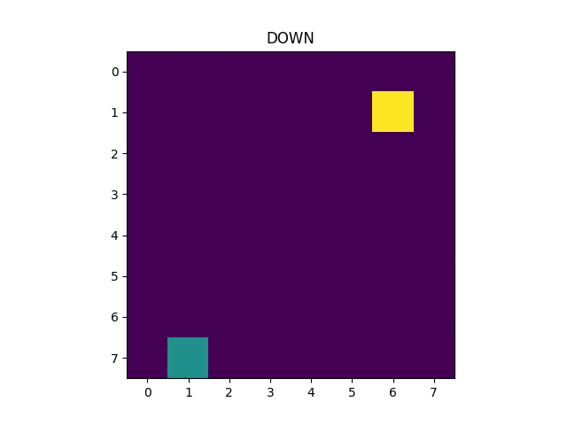

# SnakeGame
A simple reinforcement learning (snake) game that I wrote for fun while exploring RL during my Master. The learning algorithm of the snake is based on Monte-Carlo using every visit update.
More details can be found in the code!

The project is composed of two main scripts:
\enum
1. Scripts/snake.py - contains the snake logic (Monte-carlo, Q-learning, train/test loop).
In order to train/test your algorithm please change the relevant parameters under the __main__ section. 
2. SnakeGame.py - The actual snake game - (based on OpenAI Gym API https://gym.openai.com/envs/#classic_control).

Feel free to add you own algorithm and test it using the SnakeGame class in SnakeGame.py!
Enjoy!

